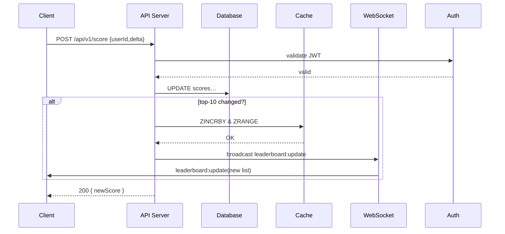

# Live Scoreboard Module

## Overview
A backend service module to track user scores, expose an API for score updates, and push live scoreboard updates to clients in real time.

## Features
- Update a user’s score via REST endpoint  
- Prevent unauthorized score tampering  
- Publish live “top-10” leaderboard updates via WebSocket/SSE  
- Horizontal-scaleable using pub/sub (e.g. Redis, Kafka)

## Table of Contents
- [Live Scoreboard Module](#live-scoreboard-module)
  - [Overview](#overview)
  - [Features](#features)
  - [Table of Contents](#table-of-contents)
    - [Architecture](#architecture)
    - [API Endpoints](#api-endpoints)
    - [Authentication \& Security](#authentication--security)
    - [Data Models](#data-models)
    - [Error Handling](#error-handling)
    - [Diagram](#diagram)
### Architecture
- Clients send score‐update requests  
- App server validates auth, updates database  
- Leaderboard cache refreshed  
- New top-10 emitted to subscribed clients  

### API Endpoints

| Method | Path                | Auth     | Body                         | Response              |
| ------ | ------------------- | -------- | ---------------------------- | --------------------- |
| POST   | `/api/v1/score`     | JWT Bearer | `{ userId: string, delta: number }` | `{ newScore: number }` |
| GET    | `/api/v1/scoreboard`| None     | —                            | `{ top10: Array<{userId,score}> }` |

### Authentication & Security
- **JWT** access tokens required on `POST /score`  
- Validate token signature, ensure `userId` in body matches token subject  
- Rate-limit writes (e.g. 5 updates/second) to slow brute-force abuse

### Data Models

```ts
interface Score {
  userId: string;      // PK, also from auth token
  score: number;
}

interface Leaderboard {
  userId: string;
  score: number;
}
```

### Error Handling
- 400 Bad Request for malformed payload
- 401 Unauthorized for missing/invalid JWT
- 429 Too Many Requests when rate limit exceeded
- 500 Internal Server Error for unexpected failures

### Diagram

